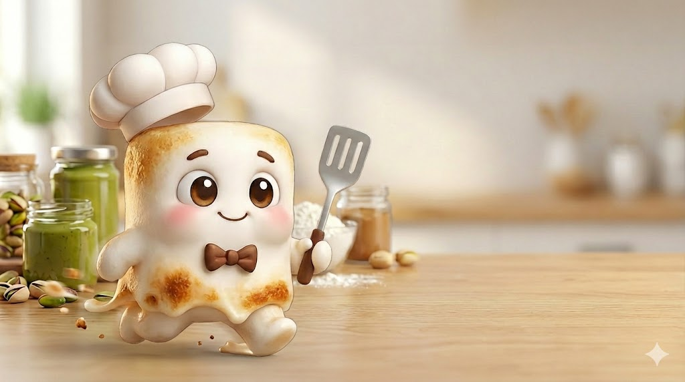

# 🍪 쫀쿠대란

> 몰입캠프 두쫀쿠를 못 구하니 두쫀쿠 만들기 게임을 만들었다!  
> 이름하여 **쫀. 쿠. 대. 란.**

---

## 🎮 게임 소개

### 0) 조작법

- **이동**: 방향키(← ↑ ↓ →)
- **집기/놓기**: 스페이스바(␣)
- 재료 앞에서 ␣ → 집기 / 작업대·팬·믹서기 앞에서 ␣ → 넣기/놓기

### 1) 피스타치오 스프레드 만들기

1. 피스타치오 껍질을 깐다
2. 믹서기에 넣고 간다 → **피스타치오 스프레드 완성**

### 2) 속 만들기

1. 화이트 초콜릿을 전자레인지에 녹인다
2. 피스타치오 스프레드 + 카다이프를 넣는다
3. 냉동고에 넣어 얼린다 → **속 완성**

### 3) 피(겉) 만들기

1. 팬에 버터를 녹인다
2. 마시멜로우를 추가해서 완전히 녹인다
3. 불을 끄고 탈지분유 + 코코아파우더를 넣는다
4. 판에 펼친다 → **피 완성**

### 4) 합체(완성)

1. 냉동고에서 속을 꺼낸다
2. 속을 한 개씩 집어서 피로 감싼다
3. 코코아파우더를 묻힌다
4. 포장한다 → **완성!**

### ⚠️ 주의사항!

- 재료들(마시멜로우, 버터, 카다이프)을 불에 오래 올려두면 타요 🔥

## 🏁 점수 기준

- **상**: 1인 - 4개 이상, 2인 - 6개 이상, 3인 - 7개 이상, 4인 - 8개 이상  
- **중**: 1인 - 3개, 2인 - 5개, 3인 - 6개, 4인 - 7개  
- **하**: 1인 - 2개 이하, 2인 - 4개 이하, 3인 - 5개 이하, 4인 - 6개 이하  

---

## ⚙️ 기술 스택

### Frontend

- React
- Vite
- React Router
- CSS

### Backend

- Node.js
- Express.js
- Socket.io
- Google OAuth

### DB/Server

- MySQL
